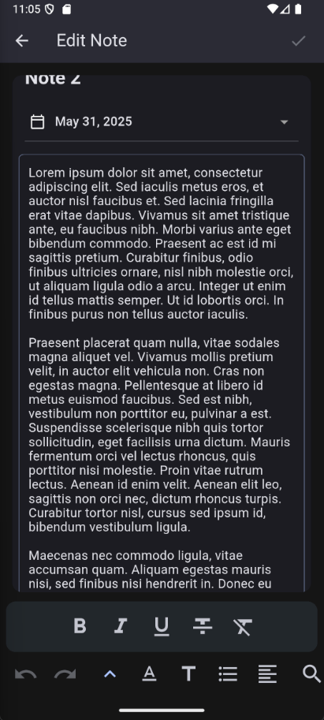

# Notes App

A Material 3 note keeping app made with Flutter.

## Features

- Rich text editor
- Note filtering
- Date picker
- Backup and restore

## Showcase

   
   
   
   

## Requirements

- Android 5 or newer

## Installation

1. Go to latest release
2. Download an apk compatible with your device (arm-v8 is recommended for newer phones)
