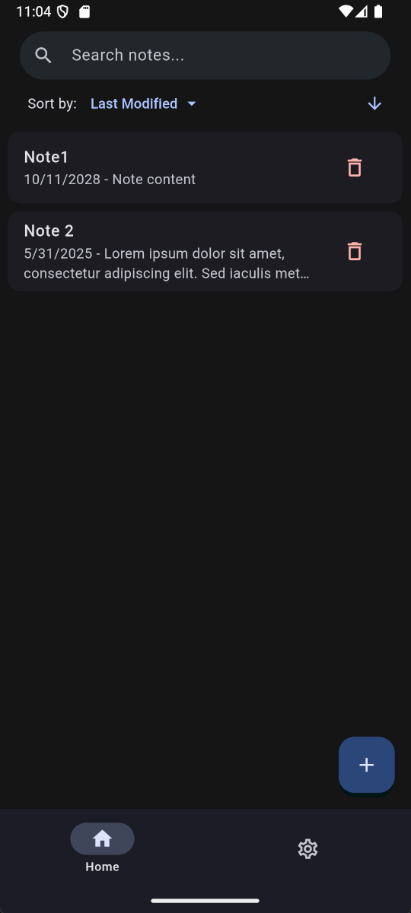
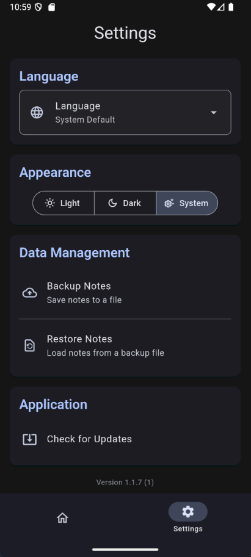
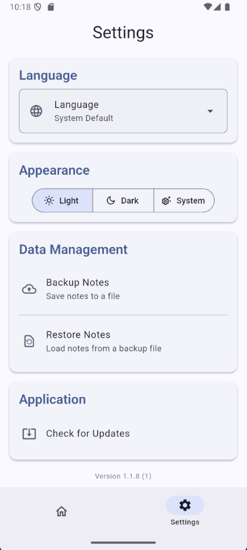

# NotesApp

A Material 3 app for writing down notes and keeping track of important things.

## Features

- Feature-rich text editor
- Note sorting/filtering
- Date picker
- Backup and restore
- In-app updater

## Showcase

   
   
   
   

## Requirements

- Platform: Android
- Operating System: Android 5 or newer
- Network: Optional, needed for in-app updater

## Installation and setup

1. Head to the latest release
2. Download an apk file compatible with your device (arm-v8 is recommended for phones manufactured after 2016)
3. Install the downloaded file
4. Open the installed application
