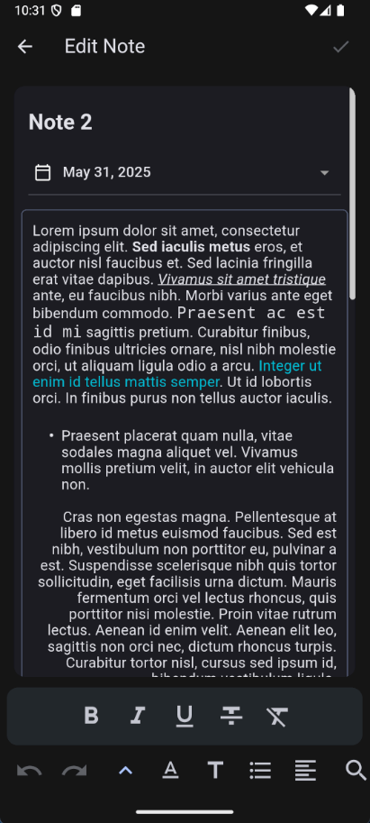

# 📝 NotesApp

A clean, Material 3–powered note-taking app for writing down ideas, organizing thoughts, and tracking what matters most — all in a simple and elegant interface.

---

## ✨ Features

* 🖋️ **Rich Text Editor:** Format your notes with a feature-packed editing interface.
* 🗂️ **Sorting & Filtering:** Easily organize notes by date, title, or content.
* 📅 **Date Picker:** Attach or edit creation dates for better note management.
* 💾 **Backup & Restore:** Export and import your notes safely at any time.
* 🔄 **In-App Updater:** Download and install updates directly from within the app.

---

## 📱 Showcase

   
   
   
   

---

## ⚙️ Requirements

| Requirement    | Details                                     |
| -------------- | ------------------------------------------- |
| **Platform**   | Android                                     |
| **OS Version** | Android 7.0 (Nougat) or later               |
| **Network**    | Optional — required only for in-app updates |

---

## 📦 Installation

1. Go to the [**latest release**](../../releases/latest).
2. Download the `.apk` file compatible with your device.
3. Install the APK on your Android device.
4. Launch **Notes** and start writing! ✍️

---

## 🧾 License

This project is open source and available under the **MIT License**.
See the [LICENSE](LICENSE) file for full details.
